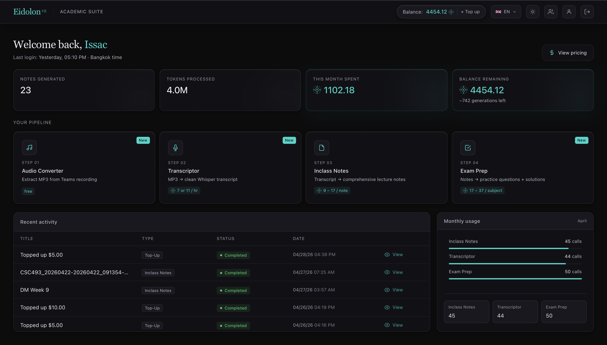
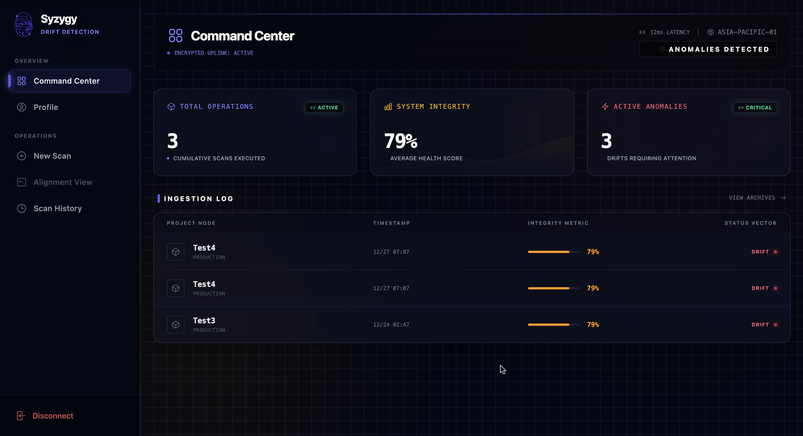
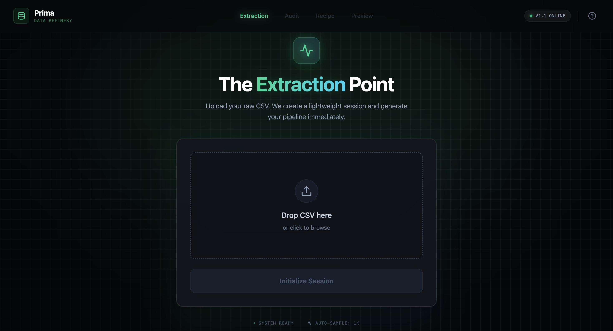

# Hollow Pink

Personal portfolio built with React, TypeScript, Vite, and Tailwind CSS. The site showcases featured projects, detailed case-study pages, and contact information in a single fast client-side app.

## Highlights

- Landing page with featured projects and profile summary
- Dedicated projects index with status tags and tech stacks
- Detailed case-study pages for Eidolon, Syzygy, and Prima
- Animated UI with custom visual components and neon-styled presentation
- Production image optimization using AVIF assets for faster loads

## Tech Stack

- React 19
- TypeScript
- Vite
- React Router
- Tailwind CSS v4
- Lucide React

## Local Development

```bash
npm install
npm run dev
```

Open the local Vite URL shown in the terminal.

## Production Build

```bash
npm run build
```

The production bundle is generated in `dist/`.

## Routes

- `/` home page
- `/projects` project listing
- `/projects/:id` project detail page
- `/contact` contact page

## Featured Project Previews

### Eidolon



### Syzygy



### Prima



## Project Structure

```text
src/
  components/        reusable UI and visual effects
  assets/            fonts, screenshots, resume, icons
  App.tsx            landing page
  ProjectsListPage.tsx
  ProjectPage.tsx
  ContactPage.tsx
  main.tsx           router entry point
docs/images/         long-form project screenshots used in case studies
```

## Notes

- This is a client-rendered SPA using `BrowserRouter`.
- Static assets are bundled by Vite.
- Large screenshots used in the UI have been converted to AVIF to reduce transfer size in production.
